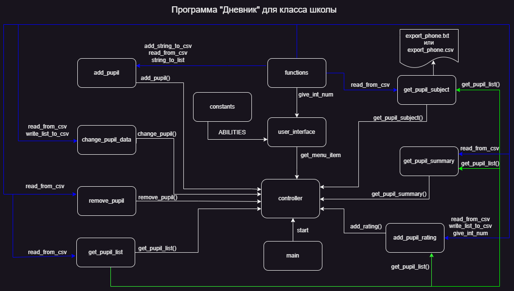

# Создание программы похожей на электронный дневник.
```sh
Создать информационную систему позволяющую работать с сотрудниками некой компании \ студентами вуза \ учениками школы
В рамках этого обсуждения вам надо нарисовать “архитектуру” (например, в виде блок-схемы) для работы данного приложения.
```

## Распредление задач в гурппе

1. Анна - add_pupil.py 'Добавить учащегося',
2. Александр - add_pupil_rating.py 'Добавить оценку'
3. Игорь - get_pupil_summary.py 'Создание ведомости по ученику'
4. Сергей - get_pupil_subject.py 'Успеваемость учащегося по предмету', get_pupil_list.py 'Показать список класса', main.py, user_interface.py, get_pupil_list.py, controller.py, readme.md
5. Костя - change_pupil_data.py 'Редактирование данных учащегося',
6. Kate - remove_pupil.py 'Удаление учащегося'.


## блок схема

На блок-схеме изображена схема взаимодействия между модулями программы с указанием передаваемых функций




